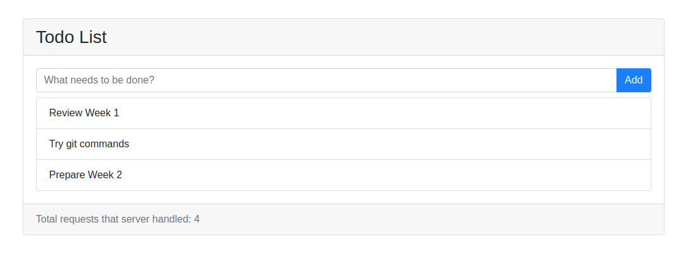

# Week 1: Get started with Git commands and Nodejs

## Git

Following are some useful commands which are not listed on the slides:

- `git status` - Show the working directory status.
- `git log` - Show commit logs
- `git diff` - Show changes between commits, commit and working tree, etc.
- `git config -l` - List all git configurations for the current project. If using outside the git working directory, it will list all the global configurations (if you set any), such as your user name and email.

Google those commands for more detailed usage. [Pro Git](https://git-scm.com/book/en/v2) is a free ebook to learn more about Git. If you want to be proficient with Git, this is a very good resource.

Another thing not included in the slides but quite useful is to use `.gitignore` file to intentionally not let git track files, such as `node_modules`. Here is an [example](../.gitignore).

Many IDEs (will talk about this later) integrate git tools to help you with git operations without directly using commands. However, if you prefer to use git commands from console, I suggest to use SSH protocol instead of HTTPS protocol. Typing password every time you do a pull or push is very annoying (Also, many students experienced "403 HTTP request failed" problem on lab computer due to the outdated version of git). Have a look at this [instruction](https://help.github.com/articles/connecting-to-github-with-ssh/) on how to connect GitHub with ssh.

## NPM CLI commands

In class we used `npm init` to create a nodejs project and `npm install [package name]` to install package. NPM has a set of CLI commands in the format of `npm <command> [args]`. For more information, please have a look at [here](https://docs.npmjs.com/cli/init). Some of them we may often use in the future, like `build`, `test` and `start`.

## An Express framework example

A simple **Todo List** express app is provided in [express_example](./express_example). The app is partially finished as it only allows to add new todo, without editing and deleting function. They will be covered in the future. 

The source code demonstrates following features of express:

- [Using template engine](https://expressjs.com/en/guide/using-template-engines.html) for serving dynamic pages : [ejs](http://ejs.co/) is used as it is very similar to PHP html templating.
- [Using middleware](https://expressjs.com/en/guide/using-middleware.html): [body-parser](https://www.npmjs.com/package/body-parser) is used to parse request bodies before handlers (such as handling post request with form data).
- [Writing middleware](https://expressjs.com/en/guide/writing-middleware.html): a very simple middleware is used to count the total number of requests that handled by the express server.



To run the app:
```bash
cd week01/express_example
npm install 
npm start  # Check the 'scripts' key in package.json and see how the 'start' command is configured. 
```

## IDE

I recommend to use [WebStorm](https://www.jetbrains.com/webstorm/). It's a commercial product and very powerful. You can use your student email to register an account and use all the features for free!

Other than WebStorm, you can refer to this [article](https://ourcodeworld.com/articles/read/200/top-7-best-free-web-development-ide-for-javascript-html-and-css) and choose your favourite.

