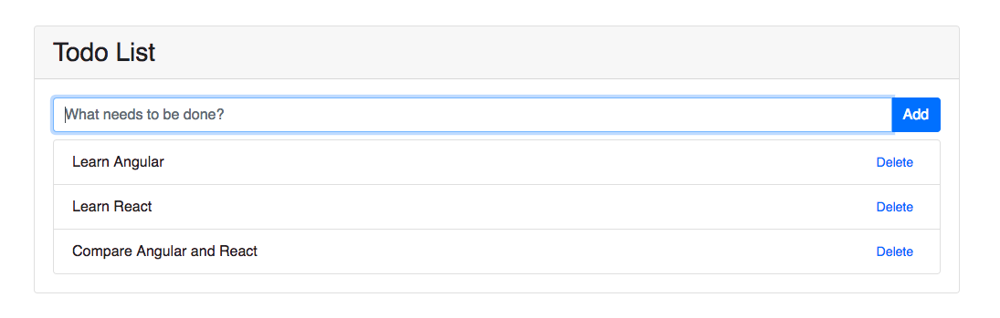

# Full stack Application (Angular/React + Express)

Last week, two SPAs (Single Page Application) for **Todo List** are provided by using Angular and React respectively. They are pure client side apps and not able to save your todos once you close the web page. However, in our first week's example which implemented by express, our todo list can live util you close the express web server. This is not perfect as it does not employ any database technology for data persistence out of the server life cycle. Nevertheless, if we can combine the express server and the SPA (either Angular or React), it will be a big step towards a full-stack web app.

This week's examples demonstrate how to do a full-stack (well, sort of, without database) application with Express and Angular/React. A new functionality is also added for deleting the a todo item. What you need to pay attention to is how Angular and React communicate to the server, manage the application state and update views after receiving responses from server. 



To run the applications, `cd` to `angular-full-stack-example` or `react-full-stack-example` and run: 

```bash
npm install  # install node packages
npm run build  # build the application and the artifacts will be stored in /dist or /build 
node server.js  # start express server to serve the app and handle requests from client
```