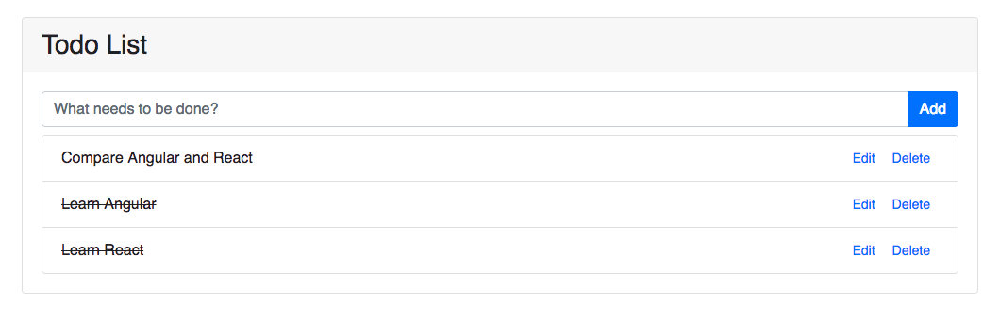

# Client Side Routing with Angular/React

This week, our focus is to enable client side routing for our **Todo List** web app. This is for mapping app pages or components into different URLs. Client side routing is basically same with server side routing. However, routing on client side is running in the browser, while server side routing is primarily used to provide RESTful endpoints for data communication and persistence.  

Let's give our Todo app a new view called *Todo Editor*, where we can modify the todo content and mark the todo item as completed. By clicking the editor link on the todo list, we should be able to navigate to the editor. Therefore, we will simply have two routes, as shown below:

```http://localhost:8000/todo-list```


```http://localhost:8000/todo-editor/:id```


We need to add one ```todo-editor``` component in the Angular/React front-end. And also, for the back-end, a ```put``` request handler is created for updating the todo item. So now, our back-end features all CRUD operations.

Angular has built-in routing module, [here](https://angular.io/guide/router) is a detailed documentation.

For React, we need to install a third party package called ```react-router-dom```. I strongly suggest to read the [docs](https://reacttraining.com/react-router/web/guides/philosophy) carefully if you are a fan of React and declarative programming paradigm. You will find it interesting when comparing the way with Angular's routing approach.